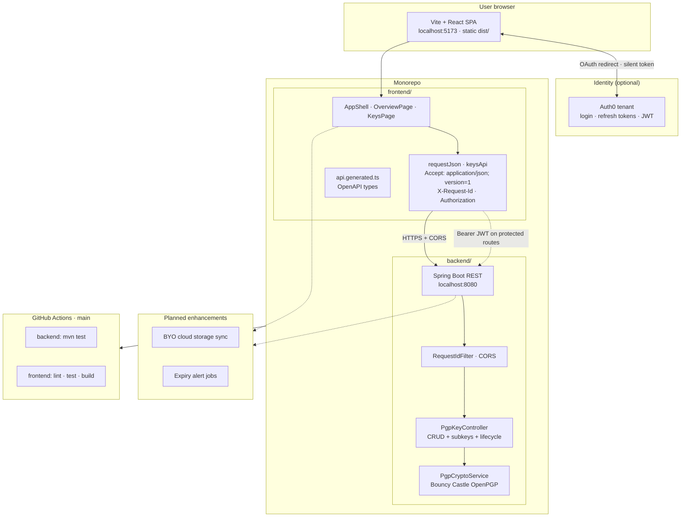
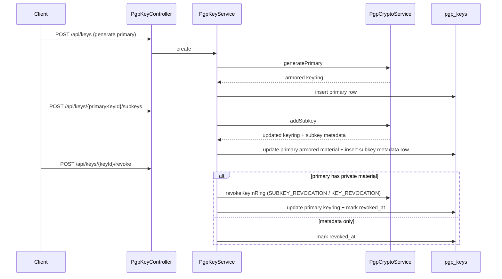
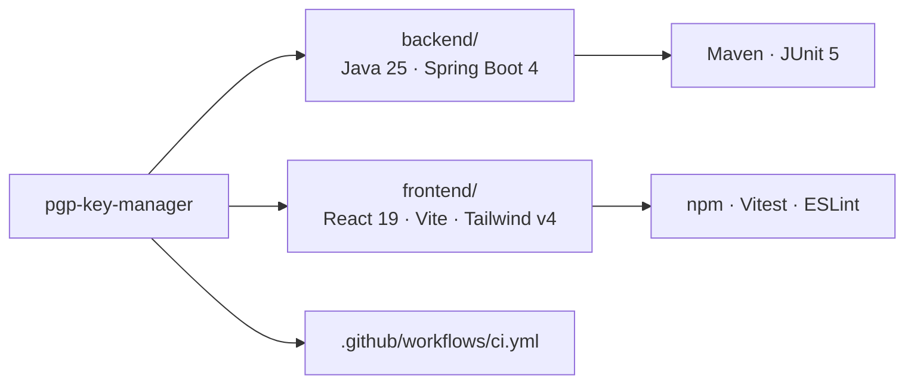

# Architecture

The application splits responsibilities between a browser-hosted UI and a JSON API. Authentication is delegated to Auth0; protected key routes require a Bearer JWT. The backend implements OpenPGP key management (primary/subkey model, lifecycle actions) using Bouncy Castle for cryptographic operations.

This repository is a **monorepo**: a Spring Boot API (`backend/`) and a static-hosted Vite + React SPA (`frontend/`). The browser talks to the API directly (CORS enabled for local Vite); there is no Next.js server.

## System overview



## Request flow (health check)

On load, the Overview page calls the scaffold endpoint to confirm API reachability. The same client helper will attach an access token when Auth0 is configured and routes require auth.

```mermaid
sequenceDiagram
  autonumber
  participant U as User
  participant SPA as React SPA
  participant A0 as Auth0
  participant API as Spring Boot API

  U->>SPA: Open app
  SPA->>API: GET /api/hello<br/>Accept: application/json; version=1<br/>X-Request-Id: UUID
  API->>API: RequestIdFilter → MDC · echo header
  API-->>SPA: 200 { "message": "ok" }<br/>X-Request-Id
  SPA-->>U: Footer: Connected

  opt Auth0 configured
    U->>SPA: Log in
    SPA->>A0: loginWithRedirect
    A0-->>SPA: Session + refresh token (localStorage)
    Note over SPA,API: Protected calls use apiFetch(..., { accessToken })
    SPA->>API: Future protected routes<br/>Authorization: Bearer JWT
  end
```

## Key lifecycle (API)



**Transactional boundaries:** `PgpKeyService` mutations run in a single database transaction so keyring updates and row inserts succeed or roll back together.

**Passphrase handling:** passphrases are converted to `char[]`, used for Bouncy Castle decrypt/sign operations, then zeroed via `PassphraseUtil`.

## Frontend API client

Browser calls use `requestJson` (`frontend/src/lib/api-client.ts`) on top of `apiFetch`. Each request carries:

- **`operationId`** — matches OpenAPI operation names (e.g. `listKeys`, `getHello`) for `[pgp-api]` structured logs.
- **`X-Request-Id`** — client-generated UUID; echoed by the backend `RequestIdFilter` for correlation in logs and error UI.
- **RFC 7807 errors** — non-2xx responses parse `application/problem+json` into `ApiError` with human-readable `detail`.

Types are generated from `docs/openapi.yaml` via `npm run generate:api-types` in `frontend/`. Phase 0 exposes `keysApi.list()`; create/import/lifecycle clients will follow in later PRs.

Routes: `/` (overview) and `/keys` (key list panel).

## Repository layout



Quick reference:

```text
backend/          Maven, Spring Boot 4.0.x, Java 25 (org.bruneel.pgpkeymanager)
frontend/         Vite, React 19, TypeScript, Tailwind v4, shadcn-style UI, Auth0 SPA
```
