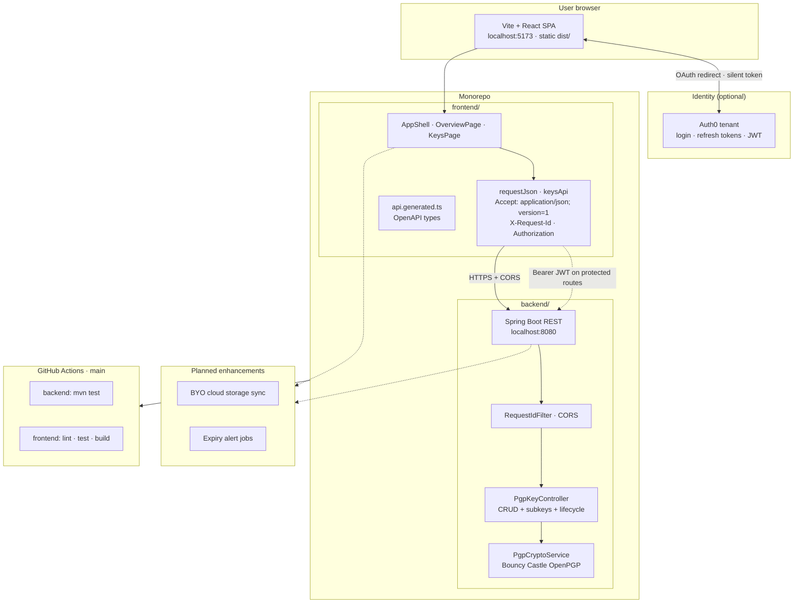
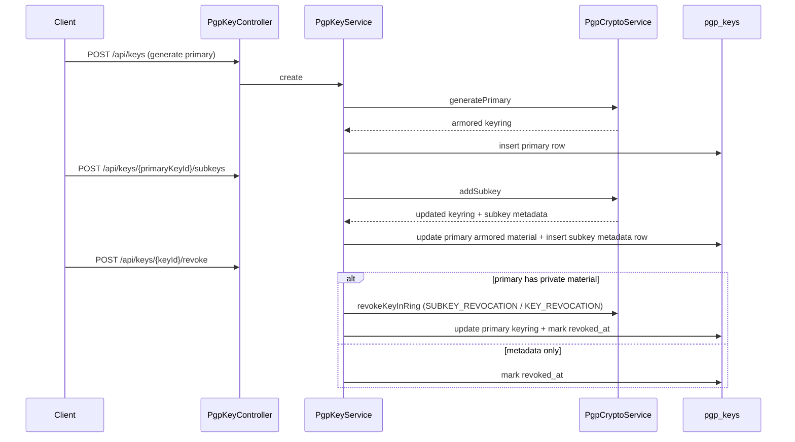
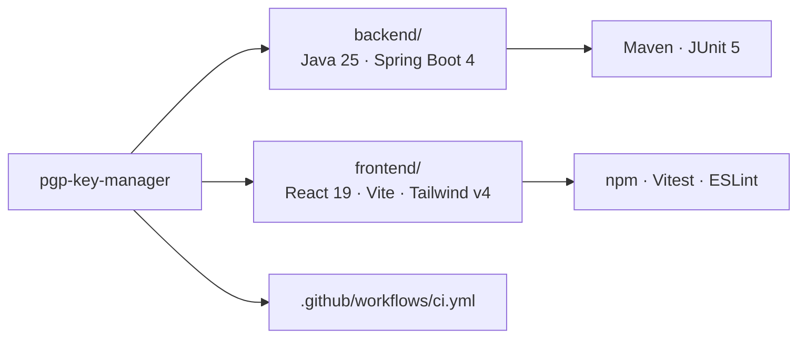

# Architecture

The application splits responsibilities between a browser-hosted UI and a JSON API. Authentication is delegated to Auth0; protected key routes require a Bearer JWT. The backend implements OpenPGP key management (primary/subkey model, lifecycle actions) using Bouncy Castle for cryptographic operations.

This repository is a **monorepo**: a Spring Boot API (`backend/`) and a static-hosted Vite + React SPA (`frontend/`). The browser talks to the API directly (CORS enabled for local Vite); there is no Next.js server.

## System overview



## Request flow (health check)

On load, the Overview page calls the scaffold endpoint to confirm API reachability. The same client helper will attach an access token when Auth0 is configured and routes require auth.

```mermaid
sequenceDiagram
  autonumber
  participant U as User
  participant SPA as React SPA
  participant A0 as Auth0
  participant API as Spring Boot API

  U->>SPA: Open app
  SPA->>API: GET /api/hello<br/>Accept: application/json; version=1<br/>X-Request-Id: UUID
  API->>API: RequestIdFilter → MDC · echo header
  API-->>SPA: 200 { "message": "ok" }<br/>X-Request-Id
  SPA-->>U: Footer: Connected

  opt Auth0 configured
    U->>SPA: Log in
    SPA->>A0: loginWithRedirect
    A0-->>SPA: Session + refresh token (localStorage)
    Note over SPA,API: Protected calls use apiFetch(..., { accessToken })
    SPA->>API: Future protected routes<br/>Authorization: Bearer JWT
  end
```

## Key lifecycle (API)



**Transactional boundaries:** `PgpKeyService` mutations run in a single database transaction so keyring updates and row inserts succeed or roll back together.

**Passphrase handling:** passphrases are converted to `char[]`, used for Bouncy Castle decrypt/sign operations, then zeroed via `PassphraseUtil`.

## Frontend navigation and UX

Key management flows use dedicated routes (not modals) so multi-field PGP forms stay deep-linkable and usable on small screens.

| Route | Purpose | Phase |
|-------|---------|-------|
| `/` | Overview (health, auth status) | Current |
| `/keys` | List keys for the signed-in user | Current |
| `/keys/new` | Create primary key (label, user IDs, expiry, passphrase, Ed25519, OpenPGP v4/v6) | Phase 1 (implemented) |
| `/keys/import` | Import/register existing key (public or private armored blocks + fingerprint) | Phase 2 (implemented) |
| `/keys/:id` | Key detail, subkeys list, add subkey, lifecycle actions (revoke, extend, rotate, export) | Phase 3 + 4 (implemented) |

**Recorded decision:** create primary key at **`/keys/new`** and import at **`/keys/import`**, not modals on `/keys`.

When Auth0 is configured, `requireAuth` wraps the routed app so unauthenticated visitors are redirected to login before protected pages load. `AuthSessionGuard` recovers stale sessions (e.g. cached user without a refresh token) by redirecting to Auth0 with `prompt=login` instead of showing a broken half-authenticated state. The SPA requests `offline_access` and enables `useRefreshTokensFallback` so new logins receive refresh tokens for silent API access.

## Frontend API client

Browser calls use `requestJson` (`frontend/src/lib/api-client.ts`) on top of `apiFetch`. Each request carries:

- **`operationId`** — matches OpenAPI operation names (e.g. `listKeys`, `getHello`) for `[pgp-api]` structured logs.
- **`X-Request-Id`** — client-generated UUID; echoed by the backend `RequestIdFilter` for correlation in logs and error UI.
- **RFC 7807 errors** — non-2xx responses parse `application/problem+json` into `ApiError` with human-readable `detail`.

Types are generated from `docs/openapi.yaml` via `npm run generate:api-types` in `frontend/`. Phase 1 exposes `keysApi.create()`; Phase 2 adds `keysApi.register()` (same `POST /api/keys`, register path); Phase 3 adds `keysApi.get()`, `listSubkeys()`, `revoke()`, `extendExpiry()`, `rotate()`, and `exportPublic()`; Phase 4 adds `keysApi.createSubkey()`. Armored public export uses `requestText()` because the API returns `application/pgp-keys` plain text.

## Create primary key flow (Phase 1)

1. User opens `/keys/new` and completes identity, passphrase, expiry, and optional advanced OpenPGP version.
2. Client validates input (`create-key-validation.ts`) and logs `[pgp-ui]` events (`createKey.pageView`, `createKey.submit`, `createKey.validationFailed`, `createKey.apiSuccess`, `createKey.apiError`).
3. `keysApi.create()` sends `POST /api/keys` with `operationId: createKey` and `X-Request-Id` correlation.
4. On success: sonner toast with fingerprint, redirect to `/keys` (list reloads). Passphrase fields are cleared locally; the server never stores the passphrase.
5. On failure: RFC 7807 `detail` and optional request ID shown in the form (mirrors key list error UX).

## Import key flow (Phase 2 + metadata enrichment)

1. User opens `/keys/import`, selects public or private mode, and pastes armored blocks. Fingerprint is optional — the server derives it from the armored material.
2. Client validates input (`import-key-validation.ts`) and logs `[pgp-ui]` events (`importKey.pageView`, `importKey.submit`, `importKey.validationFailed`, `importKey.apiSuccess`, `importKey.apiError`).
3. `keysApi.register()` sends `POST /api/keys` with a register-only body (no `passphrase`, `algorithmSpec`, or `openpgpVersion`) and `operationId: createKey`.
4. Backend `PgpKeyMetadataParser` parses the master public key from armor and stores fingerprint, key ID, algorithm, capabilities, expiry, and OpenPGP version. Logs `register_key_metadata_parsed` and uses operation id `register_key`.
5. On success: sonner toast with fingerprint, redirect to `/keys`. The key list shows capabilities and expiry (`Does not expire` when `expiresAt` is null).
6. On failure: RFC 7807 `detail` and optional request ID shown in the form.

## Key detail and lifecycle (Phase 3)

1. User opens `/keys/:id` from the primary key list (`role=primary` filter on `/keys`).
2. `keysApi.get()` loads key metadata; primary keys also load subkeys via `keysApi.listSubkeys()`.
3. Lifecycle forms validate client-side (`revoke-key-validation.ts`, `extend-key-validation.ts`, `rotate-key-validation.ts`) and log `[pgp-ui]` events:
   - `keyDetail.pageView`, `keyDetail.subkeysLoaded`
   - `keyDetail.export.submit` / `keyDetail.export.success` / `keyDetail.export.error`
   - `keyDetail.revoke.*`, `keyDetail.extendExpiry.*`, `keyDetail.rotate.*`
4. `keysApi.exportPublic()` uses `requestText` + `copyTextToClipboard` or download as `.asc`.
5. Revoke and extend require passphrase when the primary keyring stores private material; rotate is subkey-only and always requires passphrase (unlocks the primary keyring for new subkey creation; optional `revokePrevious` also revokes the current subkey in the keyring).
6. On success: sonner toast, refetch key/subkeys; rotate navigates to the new subkey. Passphrase fields are cleared after submit.

## Add subkey (Phase 4)

1. On primary key detail (`/keys/:id`), when the primary has private material and is not revoked, the **Add subkey** form appears below the subkeys list (inline — no separate route).
2. Client validates input (`create-subkey-validation.ts`); subkey capabilities exclude `certify` (shared `subkey-capabilities.ts` with rotate form).
3. `keysApi.createSubkey()` sends `POST /api/keys/{primaryKeyId}/subkeys` with `operationId: createSubkey`.
4. `[pgp-ui]` events: `keyDetail.createSubkey.submit`, `keyDetail.createSubkey.validationFailed`, `keyDetail.createSubkey.apiSuccess`, `keyDetail.createSubkey.apiError`.
5. On success: sonner toast with fingerprint, subkeys list refresh, navigate to `/keys/{newSubkeyId}`. Passphrase cleared after submit.
6. Metadata-only primaries show a hint to import private material instead of the form.

## Import subkeys from keyring (Phase 5)

1. **On primary import (`/keys/import`):** when armored material contains subkeys, `PgpKeyMetadataParser.parseKeyring()` enumerates non-master keys; `registerPrimaryKey` inserts metadata-only subkey rows after the primary row. Logs `register_subkey_metadata_parsed` and `register_keyring_metadata_parsed`.
2. **Import page UX:** after successful register, `keysApi.listSubkeys()` loads the count; toast mentions registered subkeys; redirect goes to `/keys/{id}` instead of `/keys`. `[pgp-ui]` `importKey.subkeysRegistered` when count &gt; 0.
3. **On primary detail (`/keys/:id`):** when the primary has stored armored keyring material and is not revoked, the **Import subkeys from keyring** form appears (inline — no separate route). Works for public-only and private primaries.
4. `keysApi.importSubkeysFromKeyring()` sends `POST /api/keys/{primaryKeyId}/subkeys/import-from-keyring` with `operationId: importSubkeysFromKeyring`. Idempotent — skips subkeys already registered under the primary.
5. `[pgp-ui]` events: `keyDetail.importSubkeys.submit`, `keyDetail.importSubkeys.apiSuccess`, `keyDetail.importSubkeys.apiError`.
6. On success: sonner toast with registered/skipped counts, subkeys list refresh.

## Repository layout



Quick reference:

```text
backend/          Maven, Spring Boot 4.0.x, Java 25 (org.bruneel.pgpkeymanager)
frontend/         Vite, React 19, TypeScript, Tailwind v4, shadcn-style UI, Auth0 SPA
```
