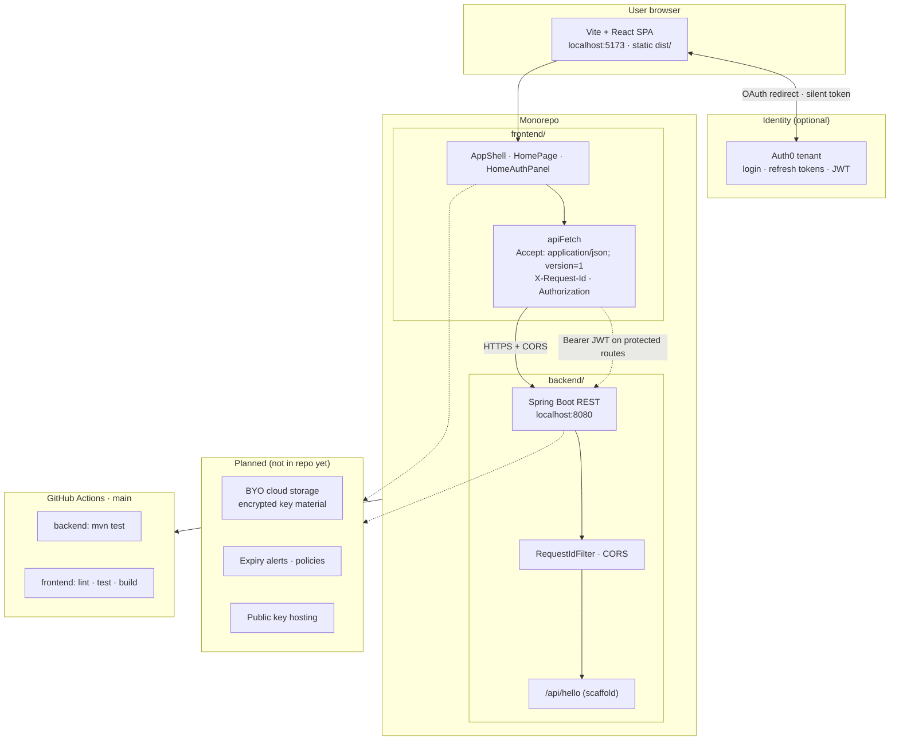
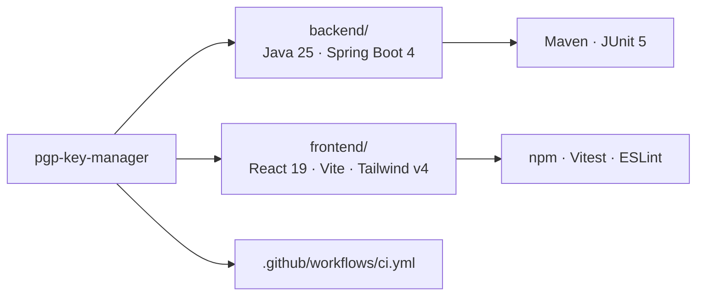

# Architecture

The application splits responsibilities between a browser-hosted UI and a JSON API. Authentication is delegated to Auth0; the API is prepared for versioned JSON and bearer tokens on protected routes. Key storage and policy features are planned in the UI shell but not yet implemented in the backend.

This repository is a **monorepo**: a Spring Boot API (`backend/`) and a static-hosted Vite + React SPA (`frontend/`). The browser talks to the API directly (CORS enabled for local Vite); there is no Next.js server.

## System overview



## Request flow (health check)

On load, the Overview page calls the scaffold endpoint to confirm API reachability. The same client helper will attach an access token when Auth0 is configured and routes require auth.

```mermaid
sequenceDiagram
  autonumber
  participant U as User
  participant SPA as React SPA
  participant A0 as Auth0
  participant API as Spring Boot API

  U->>SPA: Open app
  SPA->>API: GET /api/hello<br/>Accept: application/json; version=1<br/>X-Request-Id: UUID
  API->>API: RequestIdFilter → MDC · echo header
  API-->>SPA: 200 { "message": "ok" }<br/>X-Request-Id
  SPA-->>U: Footer: Connected

  opt Auth0 configured
    U->>SPA: Log in
    SPA->>A0: loginWithRedirect
    A0-->>SPA: Session + refresh token (localStorage)
    Note over SPA,API: Protected calls use apiFetch(..., { accessToken })
    SPA->>API: Future protected routes<br/>Authorization: Bearer JWT
  end
```

## Repository layout



Quick reference:

```text
backend/          Maven, Spring Boot 4.0.x, Java 25 (org.bruneel.pgpkeymanager)
frontend/         Vite, React 19, TypeScript, Tailwind v4, shadcn-style UI, Auth0 SPA
```
