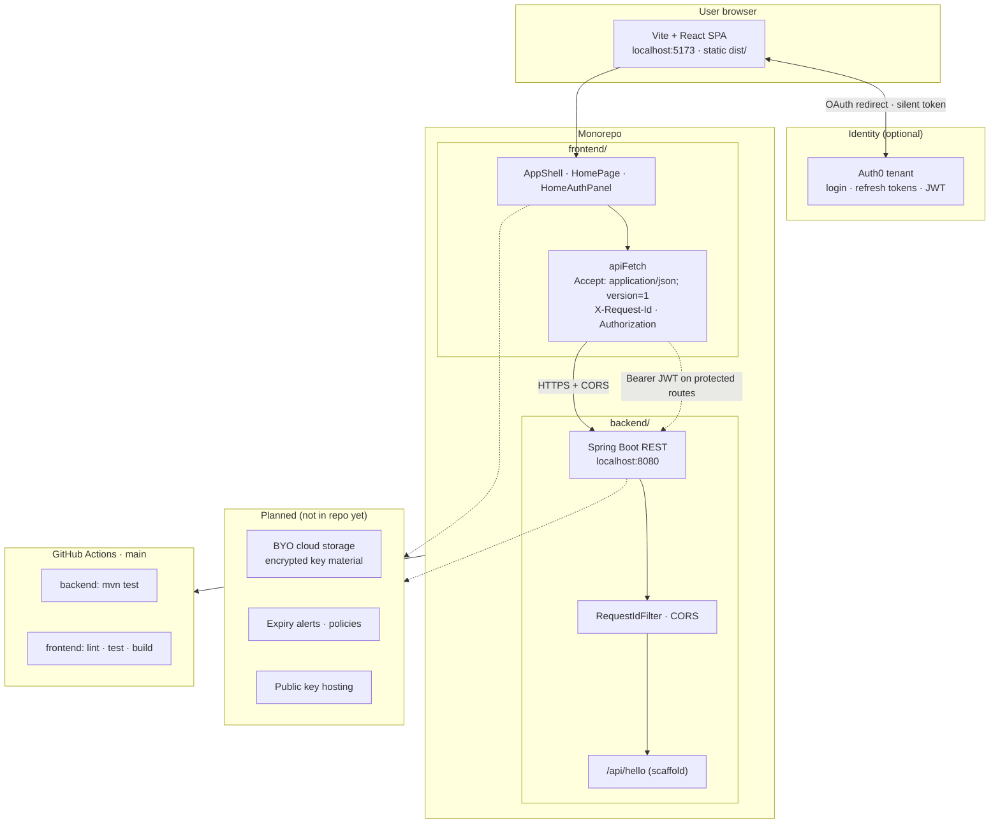
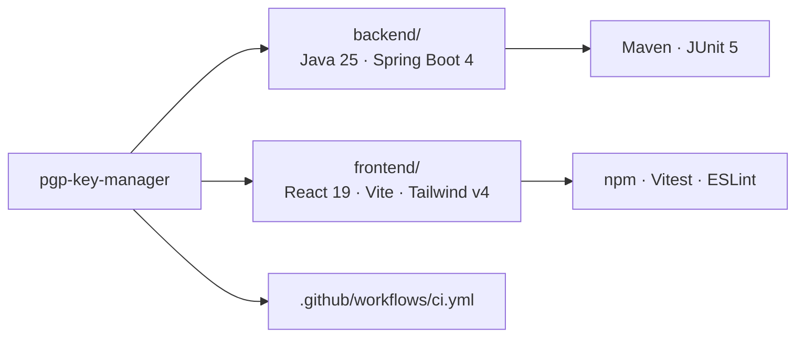

# PGP Key Manager

GUI to manage PGP keys storage. BYO cloud storage, set alerts for expiry, host public keys and more.

This repository is a **monorepo**: a Spring Boot API (`backend/`) and a static-hosted Vite + React SPA (`frontend/`). The browser talks to the API directly (CORS enabled for local Vite); there is no Next.js server.

## Architecture

The application splits responsibilities between a browser-hosted UI and a JSON API. Authentication is delegated to Auth0; the API is prepared for versioned JSON and bearer tokens on protected routes. Key storage and policy features are planned in the UI shell but not yet implemented in the backend.



### Request flow (health check)

On load, the Overview page calls the scaffold endpoint to confirm API reachability. The same client helper will attach an access token when Auth0 is configured and routes require auth.

```mermaid
sequenceDiagram
  autonumber
  participant U as User
  participant SPA as React SPA
  participant A0 as Auth0
  participant API as Spring Boot API

  U->>SPA: Open app
  SPA->>API: GET /api/hello<br/>Accept: application/json; version=1<br/>X-Request-Id: UUID
  API->>API: RequestIdFilter → MDC · echo header
  API-->>SPA: 200 { "message": "ok" }<br/>X-Request-Id
  SPA-->>U: Footer: Connected

  opt Auth0 configured
    U->>SPA: Log in
    SPA->>A0: loginWithRedirect
    A0-->>SPA: Session + refresh token (localStorage)
    Note over SPA,API: Protected calls use apiFetch(..., { accessToken })
    SPA->>API: Future protected routes<br/>Authorization: Bearer JWT
  end
```

### Repository layout



## Prerequisites

- **JDK 25** (enforced by Maven Enforcer in `backend/pom.xml`). Example: `export JAVA_HOME=/usr/lib/jvm/java-25-openjdk-amd64` on Linux.
- **Maven** (optional if you use `./mvnw` from `backend/`)
- **Node.js 22.22.2** and **npm 10.9.7** (pinned for CI; see [`.nvmrc`](.nvmrc) and `frontend/package.json` `engines` / `packageManager`)

Tailwind for the SPA uses the official **`@tailwindcss/vite`** plugin (Tailwind v4).

**CI:** [`.github/workflows/ci.yml`](.github/workflows/ci.yml) runs `backend` Maven tests and `frontend` `npm ci`, lint, test, and build on every push/PR to `main`.

## Backend (`backend/`)

### Run

```bash
cd backend
./mvnw spring-boot:run
```

Optional dev profile (extra debug logging):

```bash
./mvnw spring-boot:run -Dspring-boot.run.profiles=dev
```

API listens on **http://localhost:8080**. Sample endpoint: `GET /api/hello`.

### Test (TDD)

```bash
cd backend
./mvnw test
```

Uses **JUnit 5**, **`@WebMvcTest`** (slice) via `spring-boot-starter-webmvc-test`, and **`@SpringBootTest`** + `MockMvc` for request-id filter integration.

### Logging and correlation

- **Request ID:** filter reads or generates `X-Request-Id`, stores it in **MDC** (`requestId`), echoes it on the response.
- **Profiles:** `prod` uses **JSON** console logs (`logstash-logback-encoder`); default profile uses a readable pattern including `%X{requestId}`.
- Run with `SPRING_PROFILES_ACTIVE=prod` to exercise JSON logging locally.

### Configuration

- Defaults in [`backend/src/main/resources/application.yaml`](backend/src/main/resources/application.yaml).
- **Secrets:** do not commit credentials. Use `backend/application-secret.yaml` (gitignored) or environment variables.
- **CORS:** `CORS_ALLOWED_ORIGINS` (comma-separated), default `http://localhost:5173` for Vite.

### Versioned API headers (frontend)

Protected routes should send:

- `Accept: application/json; version=1`
- `Authorization: Bearer <jwt>` when authenticated

The scaffold’s `apiFetch` helper sets these by default. The sample `GET /api/hello` does not require auth.

---

## Frontend (`frontend/`)

### Run (with backend)

Terminal 1 — API:

```bash
cd backend && ./mvnw spring-boot:run
```

Terminal 2 — SPA (Vite, **http://localhost:5173**):

```bash
cd frontend
cp .env.example .env.local   # set VITE_API_BASE_URL=http://localhost:8080 and Auth0 placeholders
npm install
npm run dev
```

### Build (static assets)

```bash
cd frontend
npm run build
```

Output: `frontend/dist/` — deploy to any static host. `VITE_*` variables are fixed at build time.

### Quality

- `npm run lint` — ESLint flat config (`eslint.config.js`)
- `npm run test` — Vitest + Testing Library (`src/**/*.test.tsx`)

End-to-end tests (e.g. Playwright against a running API) are optional and not wired in this scaffold.

---

## Directory reference

See the [repository layout diagram](#architecture) above. Quick reference:

```text
backend/          Maven, Spring Boot 4.0.x, Java 25 (com.example.pgpkeymanager)
frontend/         Vite, React 19, TypeScript, Tailwind v4, shadcn-style UI, Auth0 SPA
```
