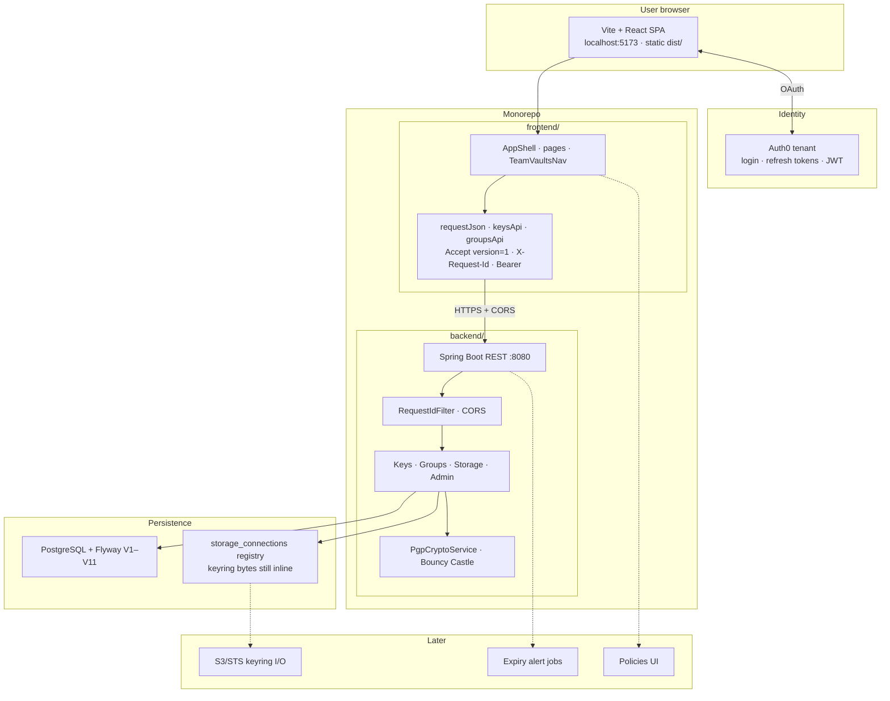
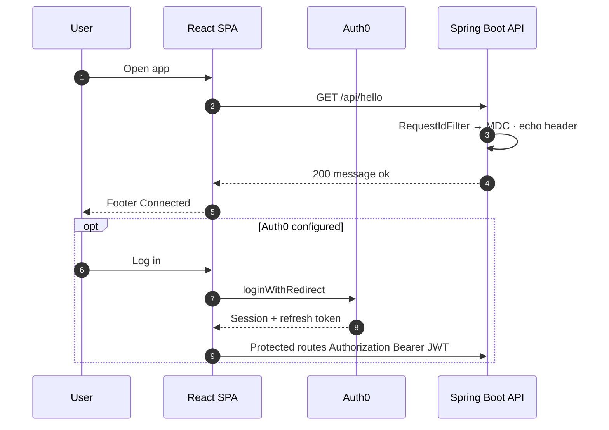
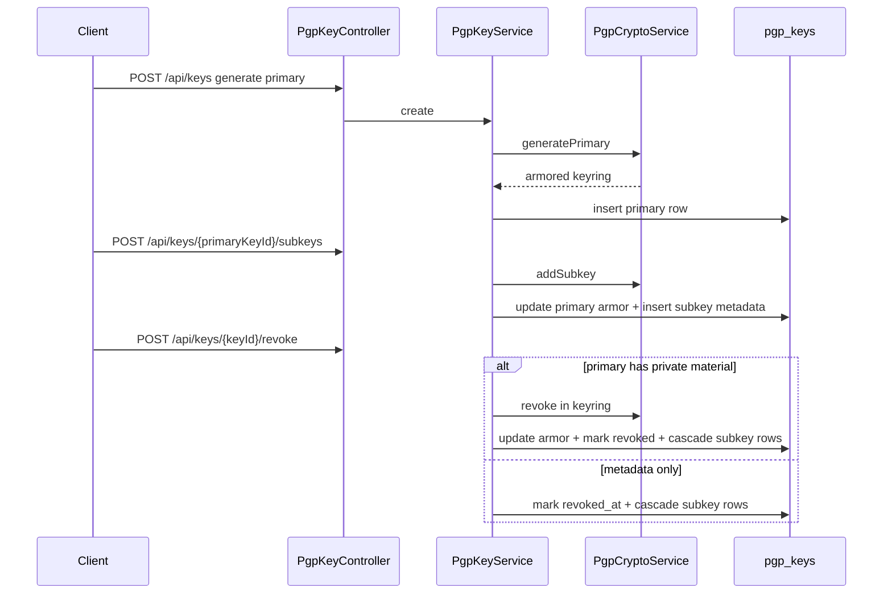
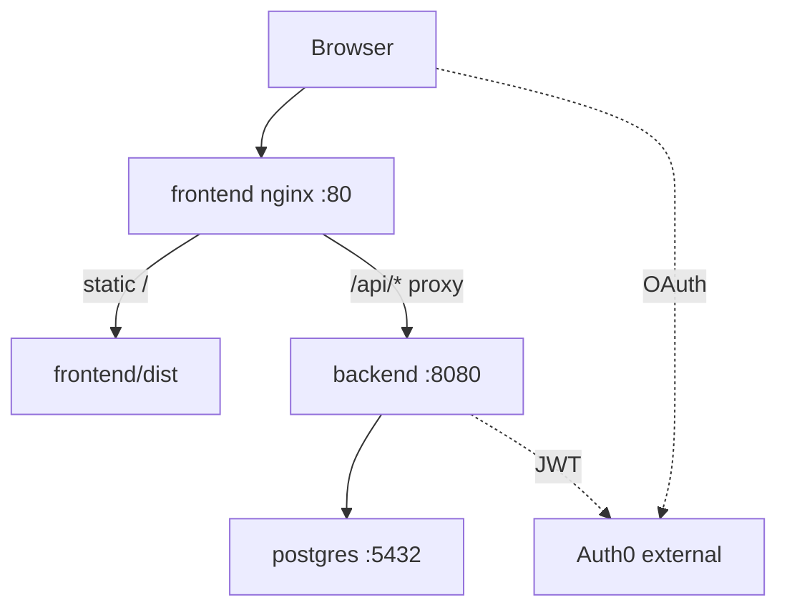

# Architecture

Conceptual model of PGP Key Manager. Phase-by-phase history lives in [Phase history](/changelog/phases).

## System overview



## Request flow (health + auth)



## Key lifecycle (API)



**Transactional boundaries:** `PgpKeyService` mutations run in one DB transaction.

**Passphrase handling:** DTOs use wipeable `char[]`; memory cleared after crypto.

## Team vaults and navigation

- `GroupProvider` loads `/api/groups` and holds active group context.
- Sidebar **`TeamVaultsNav`** lists teams with Public / Private / Subkeys / Members. Last expanded team id is stored in `localStorage`. Top-bar vault switcher was removed.
- Keys listing supports `groupId` and `scope=personal|group|all`.
- Create/import may set `ownerGroupId`. Transfer ownership moves primary + subkeys between vaults (owner ACL).

Group membership authorization is app-DB source of truth (`group_members`), not Auth0 Organization roles.

## BYO storage registry

Connection registry only: `storage_connections` + `/settings` CRUD + [`storage_ref` URI](./storage-ref). Keyring bytes remain inline in Postgres until S3/STS I/O lands.

## Deployment



| Aspect | Native (Vite + CORS) | Docker |
|--------|----------------------|--------|
| Frontend | `:5173` → API `:8080` | nginx `:80` same-origin |
| Database | Supabase or local Postgres | Compose Postgres 16 |
| Flyway | baseline-on-migrate as configured | fresh V1–V11 |

## Repository layout

```text
backend/     Maven, Spring Boot 4.1.x, Java 25
frontend/    Vite, React 19, TypeScript, Tailwind v4, Auth0 SPA
docs/        VitePress site + openapi.yaml (this documentation)
docker/      Compose full stack
```

## See also

- [Local setup](./local-setup)
- [Frontend](./frontend) · [Backend](./backend)
- [Phase history](/changelog/phases)
- [User concepts](/user/concepts/primary-vs-subkey)
