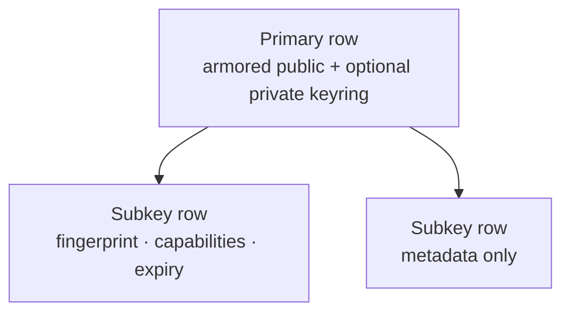

# Primary vs subkey

## Primary

- Certificate root (can certify user IDs / bind subkeys).
- Stores **armored keyring bytes** (public and optionally private).
- Create at `/keys/new`, import at `/keys/import`.
- Owns lifecycle that affects the whole certificate (revoke primary, private keyring export, transfer ownership).

## Subkey

- Bound to a primary; used for sign / encrypt / authenticate capabilities.
- Rows hold **metadata** (fingerprint, algorithm, capabilities, expiry, revocation flags).
- Crypto material for subkeys lives inside the **primary** keyring armor.
- Add or import under the primary’s **Subkeys** tab; rotate from subkey detail.

## Why it matters

Exporting “the private key” for backup means the **primary full keyring**. SSH OpenSSH material is exported from an **authenticate subkey**. Revoking a primary cascades DB revocation to active subkey rows.

## See also

- [Create](../keys/create) · [Subkeys](../keys/subkeys) · [Export private](../keys/export-private) · [SSH setup](../keys/ssh-setup)
